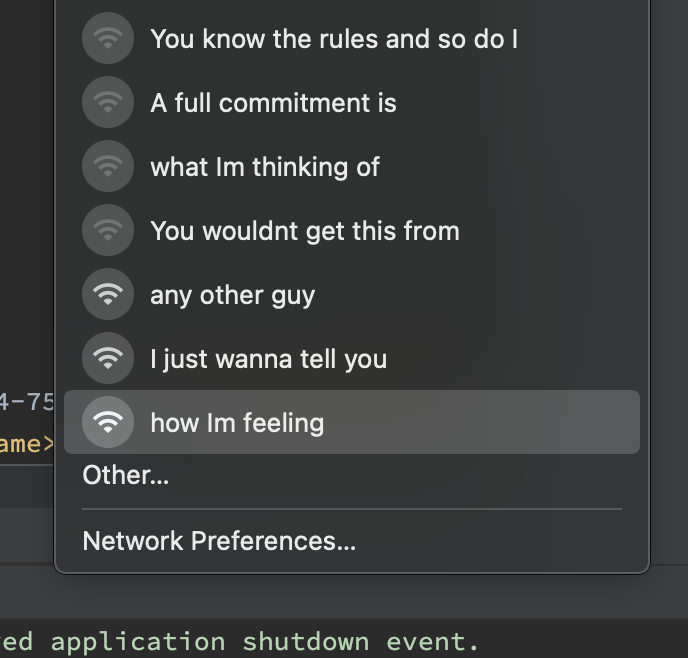

# WiFi RickRolling for ESP8266/ESP32

This tiny sketch starts a WiFi access point that changes its SSID every 30s.
It does so cycling through the lyrics of "Never Gonna Give You Up" by Rick Astley.
If you keep your computer's WiFi selector open, it will thus rebuild the entire lyrics over time.
Oh, and don't you dare actually connecting to one of those networks :)

